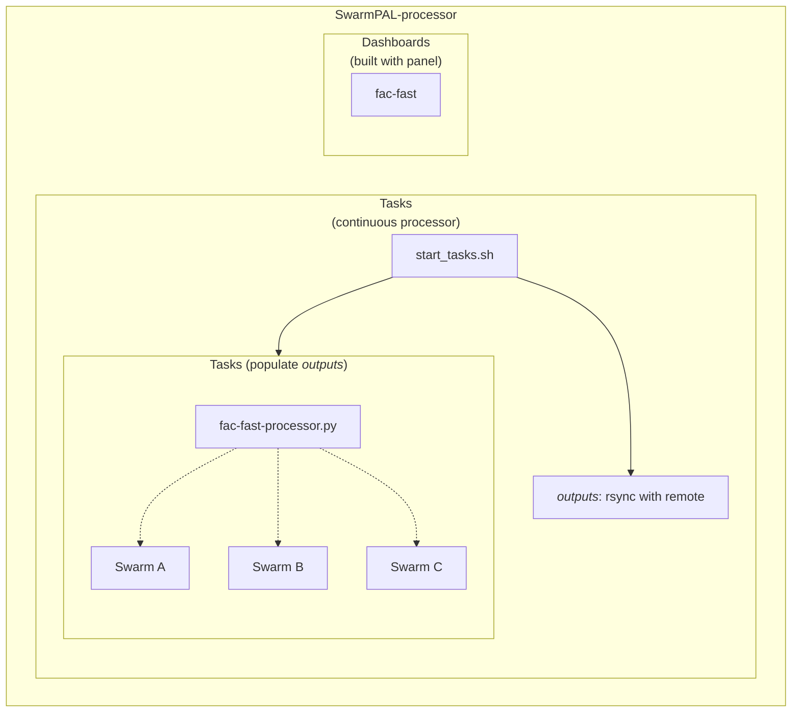

# SwarmPAL-processor

Provides both dashboards and task runner. See the dashboards deployed at:  
https://dev.swarmdisc.org/swarmpal-processor/



This repo provides Docker image:  
[ghcr.io/swarm-disc/swarmpal-processor](https://github.com/Swarm-DISC/SwarmPAL-processor/pkgs/container/swarmpal-processor)

## Run dashboard from a container

Get a VirES access token from https://vires.services/accounts/tokens/ and store it in a file called `.env`:
```
VIRES_TOKEN=.....  # NB: omit quotation marks
```

To start the container with the panel server [(see more options here)](https://panel.holoviz.org/how_to/server/commandline.html):
```
podman run --rm -it -p 5006:5006 --env-file .env ghcr.io/swarm-disc/swarmpal-processor bash -c "panel serve --allow-websocket-origin '*' /app/dashboards/*.py"
```

## Run tasks from a container (TODO)

## Development

### Managing uv environment

See <https://docs.astral.sh/uv/guides/projects/> for more information.

Adding dependencies (updates `pyproject.toml` and `uv.lock`):
- `uv add jupyterlab hvplot python-dotenv panel`
- Add specific version of swarmpal:  
  `uv add "swarmpal @ git+https://github.com/Swarm-DISC/SwarmPAL.git@c37bc7b"`
- Use [uv sync](https://docs.astral.sh/uv/reference/cli/#uv-sync) to update the lock file

Install the venv (creates `.venv/` from the specification in `uv.lock`):  
`uv sync --frozen`

Run jupyterlab for development:  
`uv run jupyter-lab`

Test the dashboards:  
`uv run panel serve dashboards/*`

(or activate the venv with `source source .venv/bin/activate`)

### Run the processor

NB: These are not stable instructions yet!

[Configure the token access](https://viresclient.readthedocs.io/en/latest/cli.html#configuration) on your machine if not already done (stores file at `~/.viresclient.ini`):
```
viresclient set_token https://vires.services/ows
viresclient set_default_server https://vires.services/ows
```

#### Run for a given time interval

(This runs the CLI provided by SwarmPAL)

Generate a FAC file from Swarm Alpha between two times:

`swarmpal fac-single-sat --spacecraft Swarm-A --grade "FAST" --time_start "2024-03-19" --time_end "2024-03-20" --output "test-A.cdf"`

Check the latest input product availability:

`swarmpal last-available-time "SW_FAST_MAGA_LR_1B"`

#### Run as a continuous task

(This runs the processor continuously to generate new FAC files locally as new data is available, and uploads them via FTP)

Configure the FTP server credentials in a `.env` file in the root of `SwarmPAL-processor`:
```
FTP_SERVER="..."
FTP_USERNAME="..."
FTP_PASSWORD="..."
```

Run for a specific satellite:
```
cd tasks
mkdir -p outputs/Sat_A outputs/Sat_B outputs/Sat_C
python fac-fast-processor.py A outputs/Sat_A FAC/TMS/Sat_A
```

Data is stored locally in `./outputs/Sat_A` and uploaded to `FAC/TMS/Sat_A` on the server. The remote file structure mimics <https://swarm-diss.eo.esa.int/#swarm/Level2daily/Latest_baselines/FAC> and is currently running as a demonstration uploaded at <https://swarmdisc.org/swarmpal-data-test/FAC>

Some problems:
- this does not mimic the behaviour of source data (<https://swarm-diss.eo.esa.int/#swarm/Fast/Level1b/MAGx_LR>) where newer data can supersede old data
- ftp upload should be handled separately and retried in the background when it fails (rather than halting the whole job)
- needs to gracefully handle errors and retry after a few minutes if there is failure
